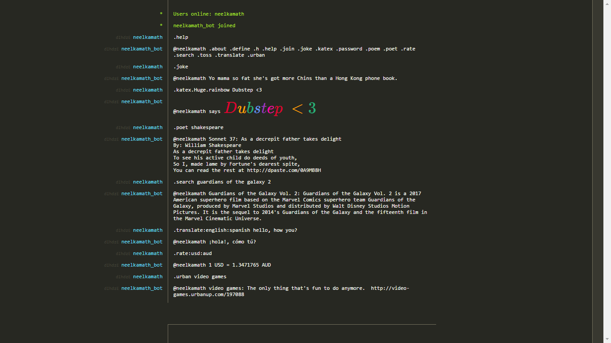

# hack.chat bot

This is a bot running on [hack.chat](https://hack.chat/) for general use and is meant to hasten tasks.

[hack.chat](https://hack.chat/) is a messaging site where you have the ability to run bots. You can enter a chat by
following the URL with `?name`, where `name` is the name of the chat (e.g., https://hack.chat/?math). Anyone can enter
this channel if they go to that URL.

 The search feature of this bot uses
[DuckDuckGo's API](https://duckduckgo.com/).

# Using the bot

If the bot, `neelkamath_bot`, is online, you can check it out by entering `'help` on the
[?programming](https://hack.chat/?programming) channel of the site.

# Local install for developers

## Prerequisites

- [Python 3 or higher](https://www.python.org/downloads/)
- [Oxford Dictionaries API tokens](https://developer.oxforddictionaries.com/documentation/getting_started) (optional)
- [Currency Converter API tokens](https://www.exchangerate-api.com/) (optional)

## Building

1. Clone the repository: `git clone https://github.com/neelkamath/hack.chat-bot`
1. Change the directory: `cd hack.chat-bot`
1. Install the dependencies: `pip3 install -r requirements.txt`

# Usage

1. Change the directory: `cd src`
1. Run the script.
    - Windows: `python bot.py`
    - Other: `python3 bot.py`

If the bot is behaving inappropriately (e.g., spamming), warnings will be printed to the console.

# Contributing

- [Code of Conduct](CODE_OF_CONDUCT.md)
- [Contributing](CONTRIBUTING.md)

# License

This project is under the [MIT License](LICENSE.txt).
